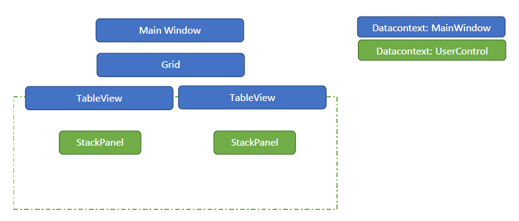

#### Kleines WPF Demo Projekt um DataBinding in UserControls zu visualisieren 

Zeigt, wie ein Wiederverwendbares UserControl für eine einfache Viewmodelklasse geschrieben wird

 + UserControl mit Databindings einer Viewmodels


````csharp
 <controls:TableView Table="{Binding Table2}"/>      
````

+ Innerhalb des UserControls Databinding In das ViewModel hinein


````csharp
<UserControl x:Class="DataBindingDemo.Controls.TableView">
    <!--Der Datacontext des UserControls ist erstmal geerbt vom UI, in der es eingebunden ist
    daher führt das Binding in das MainWindow-->
    <Grid>        
        <StackPanel>
            <Label Content="{Binding DemoTitle}" 
            Cursor="Hand"/>
        </StackPanel>        
        <!--Der Datacontext des Stackpanels wird manuell im Code behind gesetzt-->        
        <StackPanel Name="LayoutRoot">
              <TextBlock Text="{Binding Table.Name}" />
              <DataGrid ItemsSource="{Binding Table.Entries}"/>
        </StackPanel>        
    </Grid>
</UserControl>


```` 


##### Die verschiendenen Datacontexte :


